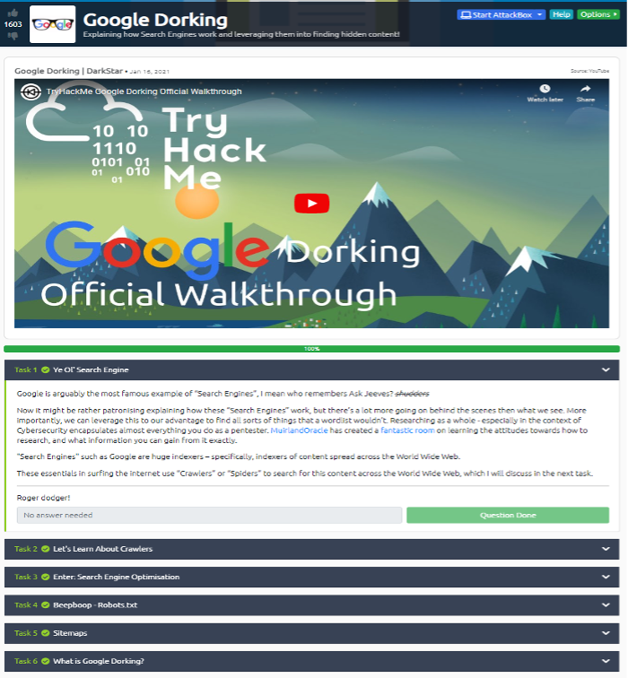
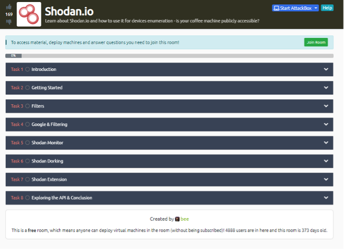
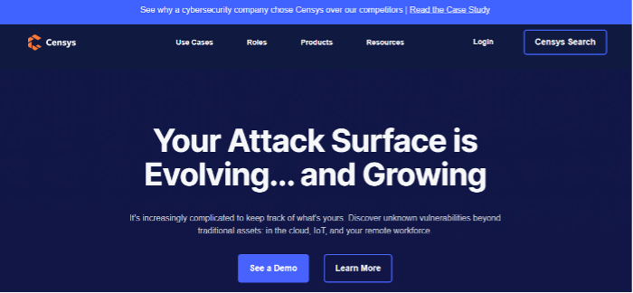

# Lab 5: Vulnerability Scanners

Estimated Time: 150 Mins
___

In this lab we’ll look at just a small subset of the vast array of recon tools available. We’ll focus on tools listed for the PenTest+ certification exam and some google dorking. Our Practical exam at the end of term will also have some related questions so it's a topic you should'nt ignore. Let all topics in pentesting, it requires lots of practice, time and testing to find the right tools to suit your own needs. We will quickly look at how to get started with the tools listed and complete some of the related rooms on the TryHackMe platform.
___

## In this lab we will: 

In this lab we will:
1.	Understanding search engines and Google dorking. 
2.	Introduction to shodan.io 
3.	Introduction to Censys.io 
4.	Whois and nslookup

___

### 4.1 Understanding Search engines and Google dorking.

Search engines can reveal huge amounts of information, and learning to use the more advanced options can help you utilise the full power of some of the search engines. To get started we will looking at the google dorking room on THM. Join the room and watch the video walkthrough of the problems.  

While Google is by fair the most popular, other search engines such as Bing offer similar capabilities so its worth checking multiple search engines and understanding the advanced options available on each of them.

- Complete the Google Dorking Room on THM
___

### 4.2 Introduction to Shodan.io

Shodan.io is a search engine for the Internet of Things. Ever wondered how you can find publicly accessible CCTV cameras? What about finding out how many Pi-Holes are publicly accessible? Or whether your office coffee machine is on the internet? Shodan.io is the answer!  

For this lab section we are going to complete the shodan.io room on THM. The room with introduce the Shodan website and some of the capabilities of the platform. So join the room now and complete the Shodan questions.  

> 💡 Shodan scans the whole internet and indexes the services run on each IP address. You can purchase full accounts, but they often do great black Friday sales etc. doing lifetime memberships and cheap $5 memberships. So if its something your interested in keep an eye out for deals.

- Complete the shodan.io Room on THM
___

### 4.3 Introduction to Censys.io

The popularity of shodan has caused a number of other similar sites to pop up in the past few years, Scan.io, Zmap.io and Censys.io. With the Censys site, probably the best known after the main shodan site, and offers some nice features.  

Check out the Censys.io website and some their demos and case studies, and try perform some of the same tasks that you performed during the earlier Shodan exercises, explore the site and try get an understanding of the capabilities on offer. Check out the query syntax help section on the Censys site to get a better understanding of the full power and option available.  

- Explore the Censys.io website 
___

> ❗ For the next few sections, we’ll very briefly introduce a few different tools, you should spend some time learning these tools.

### 4.4 whois and NsLookup

Discovering domain names, public-facing websites, and email addresses is an important part of footprinting an organization during an assessment. Pentesters are able to gather public information about organisations, computer systems, and who they belong to. Querying information about the organisation’s domain is the first step in the process. The WHOIS directory service was developed back in the 1980s to look up domain registration information from registry databases administered by multiple registries and registrars around the world. Each region has it's own registry for IP addresses.  

The American Registry for Internet Numbers (ARIN: https://www.arin.net) is the Regional Internet Registry (RIR) for North America. You can find additional information about the various regional registries on the ARIN website. The whois command, which is a client for the WHOIS directory service, is available in Kali Linux. The figure below is an example command output using the whois command to query example.com.

The output can provide useful information that can help identify domain creation date, when it was last updated, associate a company and business location for the domain, DNSSEC information, and in some cases, contact information of the registrar. The nslookup command (shown below) can be used to resolve the name of the domain to an IP address—this is called a forward DNS lookup. A reverse DNS lookup is the opposite—this process resolves the IP address to the domain name. A tool that can aid with discovering domains, subdomains, and email addresses is called theHarvester, which is also included in Kali Linux.  

DNS forward and reverse lookups are common practices executed during information gathering. One command-line tool you may see on the exam is dig. This tool is used to interrogate DNS servers and is sometimes used by administrators to troubleshoot DNS-related problems. This is another tool worth playing around with if you intend to try the actual PenTest+ Exam at some stage.
___

 

 
