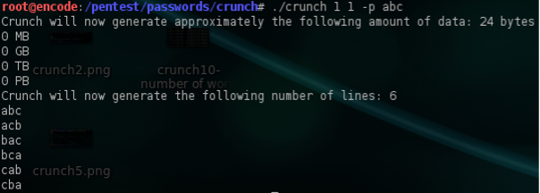
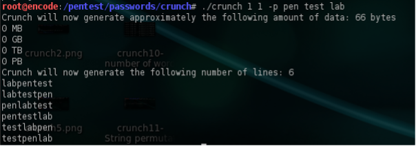
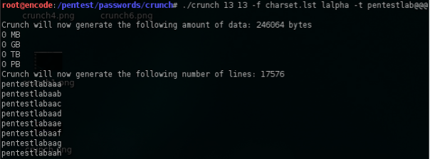

# Lab 7: Attacking Passwords

___

Passwords are a fundamental element used to protect our security and as such are often attacked as a weak point. Understanding different ways to attack passwords is a fundamental skill. In this lab we'll look at techniques that can be helpful for remote attacks and also breaking local password hashes.

## In this lab we will: 

In this lab we will:
1. Using Crunch to generate custom wordlists
2. Learning to use Hydra
3. Cracking linux password hashes
4. Cracking windows LM Hashes and SAM file
5. Introduction to Hashcat
6. THM hash cracking rooms

___


### 7.1 Using Crunch to generate custom wordlists

Many times in penetration testing engagements you will discover authentication forms that you will need to bypass in order to gain access to an application or to a remote system. Having a good wordlists always helps, but as a penetration tester you must be able to create your own custom wordlists depending on the situation. There are a variety of tools that can assist with this, but here we'll focus on Crunch.

#### 7.1.1 Create a Sample Wordlist

We can create a simple wordlist by executing the following command  
```crunch 5 5 admin -o pentestlab.txt``` 

This will instruct crunch to create a wordlist that will have minimum length of characters 5,maximum length of characters 5 with the characters of admin and it will save it on a .txt file called pentestlab.  Of course instead of just letters we can create a wordlist that will include only numbers with the command:  
```crunch 5 5 12345 -o numbers.txt```

The same method applies and if we want to create a wordlist mixed with letters and numbers.  
```crunch 5 5 pentestlab123 -o numbersletters.txt```

#### 7.1.2 Special Characters

For special characters like !$% you will need to execute something like the following:  
```crunch 5 5 pentestlab\%\@\!```

This is because some special characters need escaping and the \ is used before the character. 

#### 7.1.3 String Permutations
Here there are two options.First options is when we will want to generate something based on the characters of a word. For example ```crunch 1 1 -p abc```  will produce the following list:  
  
 
The second option is when we will want to create a list based on different words.For example the words blue and red can be bluered or redblue.We can achieve this with the command  
```crunch 1 1 -p pen test lab```  
  
 
#### 7.1.4 Splitting Wordlists

If we use the -b option we will instruct crunch to create a wordlist which will be divided into multiple files. Another option that we can combine with that command is to choose the size of our wordlist.For example:  
```crunch 6 6 0123456789 -b 1mb -o START```

This will generate wordlists which will be 1Mb each and with 6 characters size and it will include the characters 0123456789.

#### 7.1.5 Specify the number of words

Crunch allows us to specify the number of words in each wordlist.This will create a wordlists that it will contain 20 words maximum by taken a specific charset of lalpha which is [abcdefghijklmnopqrstuvwxyz].  
```crunch 3 3 -f /usr/share/crunch/charset.lst lalpha -o START -c 20```

Alternatively you can use any other charset from the list that comes with crunch if you don’t want to use a custom charset.

#### 7.1.6 Prefix Wordlists

Now lets say that we want to create a wordlist that will contains the word pentestlab followed by 3 random characters.The command for that will be:  
```crunch 13 13 -f /usr/share/crunch/charset.lst lalpha -t pentestlab@@@```
which will produce the following output:

 
Alternatively if we want the word admin to be in the middle we can modify the command like this:  
```crunch 9 9 -f /usr/share/crunch/charset.lst -t @@admin@@```

#### 7.1.7 Conclusion

Creating wordlists can facilitate your needs when performing a penetration test.Crunch of course offers a variety of options and combinations that a user can play with, look at the help pages for examples of how to create complex custom lists.Trying to brute force of course an application or a system with a wordlist can of course lock you out depending on the account lockout policy but it always helps if you can have your own custom wordlists that may be help you to obtain access.

___


### 7.2 Learning to use Hydra

While John and hashcat are great at break password hashes if you’ve managed to somehow grab some, but often we just want to try brute force some webpage login or SSH or email server or whatever. For these scenarios, our go to tool is Hydra.

Hydra is a brute force remote password cracking program; a quick system login password 'hacking' tool. We can use Hydra to run through a list and 'bruteforce' some authentication service. Imagine trying to manually guess someones password on a particular service (SSH, Web Application Form, FTP or SNMP) - we can use Hydra to run through a password list and speed this process up for us, determining the correct password.

Hydra has the ability to bruteforce the following protocols: Asterisk, AFP, Cisco AAA, Cisco auth, Cisco enable, CVS, Firebird, FTP,  HTTP-FORM-GET, HTTP-FORM-POST, HTTP-GET, HTTP-HEAD, HTTP-POST, HTTP-PROXY, HTTPS-FORM-GET, HTTPS-FORM-POST, HTTPS-GET, HTTPS-HEAD, HTTPS-POST, HTTP-Proxy, ICQ, IMAP, IRC, LDAP, MS-SQL, MYSQL, NCP, NNTP, Oracle Listener, Oracle SID, Oracle, PC-Anywhere, PCNFS, POP3, POSTGRES, RDP, Rexec, Rlogin, Rsh, RTSP, SAP/R3, SIP, SMB, SMTP, SMTP Enum, SNMP v1+v2+v3, SOCKS5, SSH (v1 and v2), SSHKEY, Subversion, Teamspeak (TS2), Telnet, VMware-Auth, VNC and XMPP.

For more information on the options of each protocol in Hydra, read the official Kali Hydra tool page: https://en.kali.tools/?p=220

This shows the importance of using a strong password, if your password is common, doesn't contain special characters and/or is not above 8 characters, it is going to be prone to being guessed. 100 million password lists exist containing common passwords, so when an out-of-the-box application uses an easy password to login, make sure to change it from the default! Often CCTV camera's and web frameworks use admin:password as the default password, which is obviously not strong enough.

Follow the Hydra introduction room on THM and watch the video walkthrough to learn how to get started with this powerful remote login brute forcing tool.

- Complete the 'Hydra' room on THM
___


### 7.3 Cracking windows and linux password hashes

#### 7.3.1 Cracking Linux Password Hashes using John the Ripper
One of the first post exploitation activities when we have compromised a target is to obtain the passwords hashes in order to crack them offline. If we managed to crack the hashes then we might be able to escalate our privileges and to gain administrative access especially if we have cracked the administrator’s hash. In this tutorial we will see how to obtain and crack password hashes from a Unix box.

Lets say that we have exploited a vulnerability and we have gained a remote shell to our target.The next step is to see the directories and files that exist on the remote system.

1. On your kali terminal change to the root directory and view all the files and folders.  
2. Switch to the /etc directory and look for the “passwd” and “shadow” files. The next step is to read the /etc/passwd file which contains all the accounts of the remote system.
   
In /etc/passwd the ':' (colon) is used separate fields, The passwd file presents information about the users (in the order shown below).

- Username.  
- Password. (using an x to indicate its been shadowed)  
- User ID. (root will always be 0)  
- Group ID.  
- Comment (usually the users full name, or about their responsibilities).  
- Users home directory.  
- The users shell (Usually is set as a default of /bin/bash or /bin/sh)
  
Now that we have the list with the accounts of the remote system we can save that list in a file for later use, maybe something like users.txt.The next step is to obtain the passwords hashes. As we know in unix systems the password hashes are stored in the /etc/shadow location so we will run the command cat /etc/shadow in order to see them.

In the /etc/shadow file you will find entries similar to this:  
root:x6FH.R4PFYGL2:11901:0:32767:7:4:12:1073741831

In /etc/shadow the ':' (colon) is used separate fields, The shadow file presents information about the users (in the order shown below).

- Username.  
- Encrypted password.  
- Number of days since January 1st 1970, that the password was last changed.  
- Number of days before the user is allowed to change their password.  
- Number of days before the user must change their password.  
- How many days in advance the user is warned of a password change.  
- Number of days remaining for the user to change their password (else their account is disabled).  
- A reserved field.
  
#### 7.3.2 Digital forensics & Cyber Security

So we will save the hashes as well in a file called shadow.txt and we will use the famous password cracker john the ripper in order to crack those hashes.

3. Copy passwd and shadow files to users.txt and shadow.txt

Next we will run the unshadow utility included with John. We will run this utility in order to be able to read the shadow file before we try to crack it. So we will need to execute the command unshadow users.txt shadow.txt > cracked.txt

This command will combine the two files that we have created before into a single file called cracked.txt.Now we are ready to crack those hashes with the command  
```john cracked.txt```  

NOTE: you might have ti use ```john --format=crypt cracked.txt```

John the ripper cracks the password hashes (eventually) and we will have all the usernames and passwords from our target. John generally has three modes - single, wordlist (with rules) & incremental, and using the command john cracked.txt will use those modes in that order.

You can check which passwords have been cracked by running the command ```john -show cracked.txt```, these passwords are stored in john.pot.

If you wish to check if any account with a userid of 0 you can use the command ```john - show -users:0 passwd.1```

If you have a couple of different password files you can get John to work on the files at the same time, by using the following command format: ```john -single passwd.1 passwd.2```

4. Create some test users on your own kali machine, give them all fairly easy short passwords, and then view the passwd and shadow files to see these users. You can use the commands useradd user1 and passwd user1 to create these users. You might also want to remove these users after the lab. userdel –r user1
   
5. Unshadow your own passwd and shadow files and try to crack the passwords with john.

6. Use John to try crack the shadow file that is included on the resources section of the pen test page on moodle.
   
Now that we have all the passwords we can use them in order to connect remotely to our target. For example if our target is running an SSH server then we use that service. Just one word of warning..you’ll need to be root on a system to see the shadow file… normal users can’t view it. It's also important to note that any password cracker is only as good as its word list. For
more complex or hybrid passwords, you probably want to use a password list containing far more passwords, including hybrid passwords such "p@$$w0rd" that combine special
characters into words. John has a pretty good password list itself.

### 7.4 Cracking windows LM Hashes and SAM file

We just demonstrated how to use John to crack some Linux passwords. Now see if you can figure out how to crack some windows passwords. You whatever tools you wish to try figure out the next two challenges.

In the lab resources for this lab you should find an example of a windows LM password hash, you need to try figure out yourself how to crack this LM password hash, you should complete this before moving onto the next challenge. In the previous example we had done the work for you, and extracted the details from a SAM file, this time you’ll need to complete the entire process yourself. You might need to do some researching to figure this one out. Can you use the Windows Sam and System files together to get the user account and password?

### 7.5 Introduction to Hashcat

You should be somewhat familiar with hashcat from our secure communications module last semester, Hashcat is a similar tool to John, and can be used to brute force almost type of password hash. It is however a lot less user friendly than John, so can take a while to get used too, but it is perhaps the fasted hash cracking tool around, once you master it, so it is well worth taking the time and learning how to use it.

See if you can complete the password cracking sections from the previous john section, and try break the same shadow files as earlier this time however using Hashcat rather than John.

### 7.6 THM hash cracking rooms

As well as brute forcing using John or Hashcat we can also take advanced on online hash cracking websites and services, there are plenty to choose from, just google to find a few to try. 

Using a combination of online crackers, john or Hashcat try complete the two hashcracking challenge rooms on THM, you can read the writeups if you need some help but try complete as many of the hashes yourself before using the writeups for help.
THM rooms to complete:
•	Crack the Hash	
•	Crack the Hash Level 2
___
