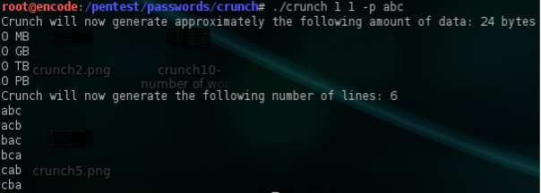
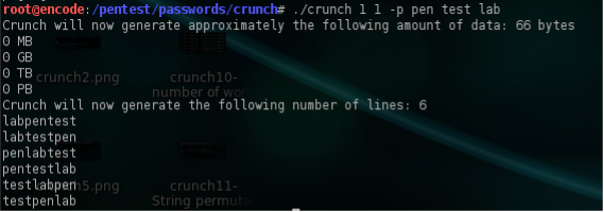
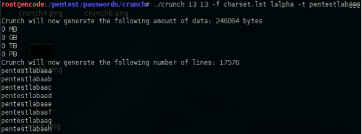

# Lab 7: Attacking Passwords

___

Passwords are a fundamental element used to protect our security and as such are often attacked as a weak point. Understanding different way to attack passwords is a fundamental skill. In this lab we'll look at techniques that can be helpful for remote attacks and also breaking local password hashes.

## In this lab we will: 

In this lab we will:
1. Using Crunch to generate custom word lists
2. Learning to use Hydra
3. Cracking windows and linux password hashes

___


### 7.1 Using Crunch to generate custom word lists

Many times in penetration testing engagements you will discover authentication forms that you will need to bypass in order to gain access to an application or to a remote system. Having a big and a good wordlists always help but as a penetration tester you must be able to create your own custom wordlists depending on the situation. There are a variety of tools that can assist you on this but here we will focus on Crunch.

#### 7.1.1 Create a Sample Wordlist

We can create a simple wordlist by executing the following command  
```crunch 5 5 admin -o pentestlab.txt``` 

This will instruct crunch to create a wordlist that will have minimum length of characters 5,maximum length of characters 5 with the characters of admin and it will save it on a .txt file called pentestlab.  Of course instead of just letters we can create a wordlist that will include only numbers with the command:  
```crunch 5 5 12345 -o numbers.txt```

The same method applies and if we want to create a wordlist mixed with letters and numbers.  
```crunch 5 5 pentestlab123 -o numbersletters.txt```

#### 7.1.2 Special Characters

For special characters like !$% you will need to execute something like the following:  
```crunch 5 5 pentestlab\%\@\!```

This is because some special characters need escaping and the \ is used before the character. 

#### 7.1.3 String Permutations
Here there are two options.First options is when we will want to generate something based on the characters of a word. For example ```crunch 1 1 -p abc```  will produce the following list:
  
 
The second option is when we will want to create a list based on different words.For example the words blue and red can be bluered or redblue.We can achieve this with the command  
```crunch 1 1 -p pen test lab```
  
 
#### 7.1.4 Splitting Wordlists

If we use the -b option we will instruct crunch to create a wordlist which will be divided into multiple files. Another option that we can combine with that command is to choose the size of our wordlist.For example:  
```crunch 6 6 0123456789 -b 1mb -o START```

This will generate wordlists which will be 1Mb each and with 6 characters size and it will include the characters 0123456789.

#### 7.1.5 Specify the number of words

Crunch allows us to specify the number of words in each wordlist.This will create a wordlists that it will contain 20 words maximum by taken a specific charset of lalpha which is [abcdefghijklmnopqrstuvwxyz].  
```crunch 3 3 -f charset.lst lalpha -o START -c 20```

Alternatively you can use any other charset from the list that comes with crunch if you don’t want to use a custom charset.

#### 7.1.6 Prefix Wordlists

Now lets say that we want to create a wordlist that will contains the word pentestlab followed by 3 random characters.The command for that will be:  
```crunch 13 13 -f charset.lst lalpha -t pentestlab@@@```
which will produce the following output:

 
Alternatively if we want the word admin to be in the middle we can modify the command like this:  
```crunch 9 9 -f charset.lst -t @@admin@@```

#### 7.1.7 Conclusion

Creating wordlists can facilitate your needs when performing a penetration test.Crunch of course offers a variety of options and combinations that a user can play with, look at the help pages for examples of how to create complex custom lists.Trying to brute force of course an application or a system with a wordlist can of course lock you out depending on the account lockout policy but it always helps if you can have your own custom wordlists that may be help you to obtain access.


- Complete the Metasploit: Introduction room on THM
___


### 7.2 Learning to use Hydra

Learn about and use Hydra, a fast network logon cracker, to bruteforce and obtain a website's credentials.

- Complete the 'Hydra' room on THM
___


### 7.3 Cracking windows and linux password hashes

Old end of life products tend to always be vulnerable and obviously shouldn't appear on a live network because of the risks associated with such systems. Your instructor will show a walkthrough of exploiting a legacy windows XP system. If you'd like to attempt the same demo you can find the a Windows XP image and key, on the module resources section on Brightspace. 

- Use metasploit to get access to Windows XP
___
